  

  

    <b>Привет, я JAVA.gnome!</b> 🥼 
    Разработчик, путешествующий по линиям мирового времени в поисках идеального кода без багов.
  

  

    

  <!-- Пасхалка с озвучкой Маюри -->
 <!--  -->

 

## 🧪 Лабораторный инвентарь (Мой стек)

  
  
  
  
  

 

## 🔬 Гаджеты Будущего (Текущие проекты)

| Гаджет | Название / Описание | Статус |
| :---: | :--- | :---: |
| **`#001`** | 🎮 **LartronLauncher** Кроссплатформенный Minecraft-лаунчер на Java (поддержка Ely.by, Microsoft Entra ID, кастомные темы и упаковка `jpackage`). | `[Alpha 1.0]` |
| **`#002`** | 🛡️ **3X-UI VPN Telegram Bot** Автоматизированный бот на Java для продажи и управления подписками VPN через API панелей 3X-UI. | `[In Dev]` |

 

## 📟 Монитор активности Лаборатории

  
  

 

---

<blockquote align="center">
  <i>«Никто не знает, что принесет будущее. Именно поэтому его потенциал безграничен.»</i> 
  <b>— Окабэ Ринтаро (Хооин Кёма)</b>
</blockquote>
